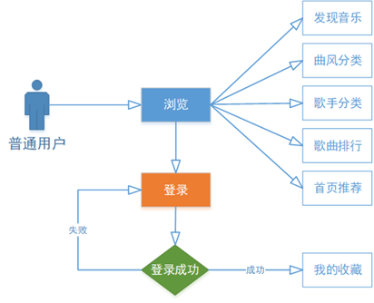

# 系统是怎样炼成的

## 1. 需求分析
做一个音乐网站
- 普通用户可以登录注册、查看音乐、收藏音乐、查看歌曲分类、歌手分类以及排名等。
- 管理员可以对歌曲以及歌手进行管理。
  
  功能性需求-》非功能性需求 淘宝秒杀 金融产品低时延 游戏1秒启动

## 2. 概要设计
   
### 2.1 用例设计(Usecase)

### 2.2 流程设计(Routine)

## 3. 详细设计

### 3.1 实体类以及实体类的图=>数据库设计

#### 3.3.1 实体类
1. 用户（用户名，密码）
2. 音乐
3. 歌手
4. 收藏夹
5. 曲风
6. 排行

#### 3.3.2 数据库表设计
约定俗成 表名对应实体名或者是业务名 字段语义清晰完整 下划线

### 3.2 原型（交互设计）=>前端

### 3.3 前后端分离了如何交互=>接口 Interface

多个单词组成的复合名词
- 小驼峰：首单词的首字母小写，后续单词首字母大写
- 大驼峰：每个单词首字母大写
- 下划线：单词间以下划线作为间隔
